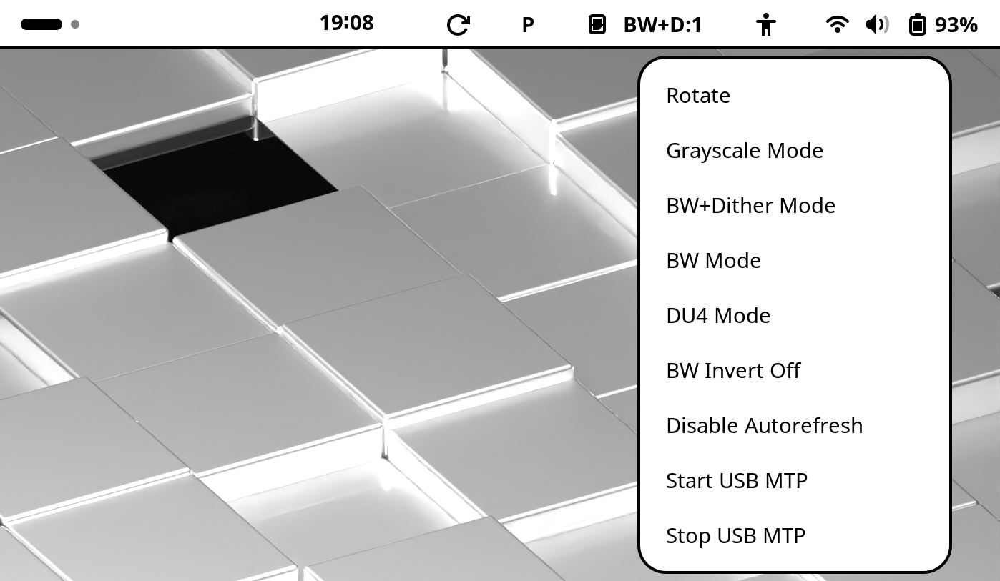
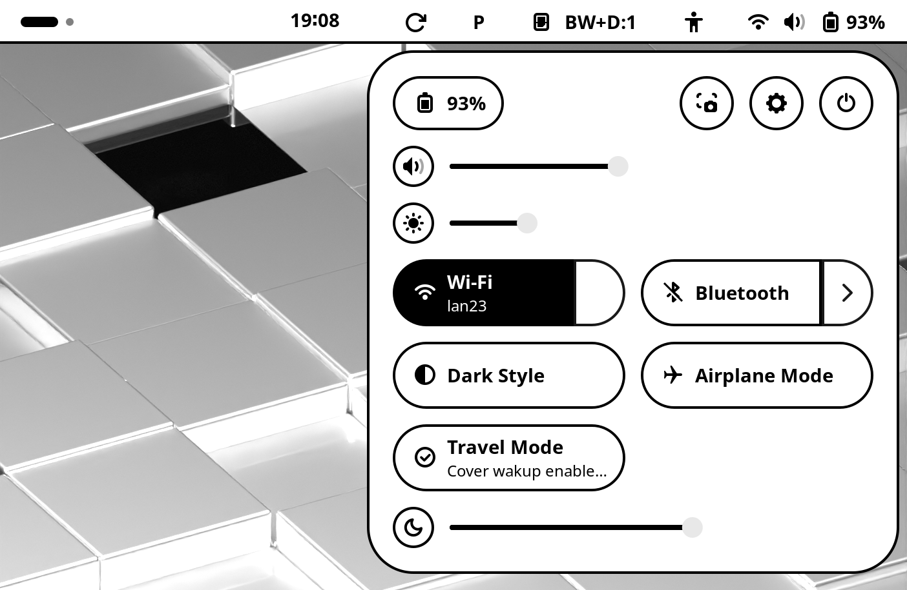

# Pinenote Gnome Extension

This is a very very hacky Gnome extension to interface with some of the
rockchip_ebc kernel driver options. It also provides a "rotate" menu option to
easily switch between landscape and portrait mode (which is handy when
switching between desktop work and ebook reading).

**While the extension is slowly maturing (with the help of the community!), I
still do not have much experience with GJS and GNOME extension development. Use
with care. Suggestions are welcome!**

**Naturally, merge requests (or rewrites) are very welcome!**

The extension provides/extends four GUI elements:

* A panel button to trigger to global screen refresh (the circular arrow
  next to the clock)
* A panel button to switch between performance (P) and quality mode (Q).
  This mainly changes frequencies of the underlying hardware. Q or
  P-labeled button in the panel, right of the global refresh button
* A menu providing quick access to certain Pinenote-related functionality.
  See screenshot below.
* Additions to the quicksettings of GNOME:
	* A slider for the warm backlight (in addition to the cold backlight
	  already controled by GNOME)
	* A toggle for travel mode. This mode deactivates the functionality
	  that wakes up the PineNote when the cover is lifted.

The panel with global refresh and performance/quality mode, as was as the
quick-access menu:

The extended quick settings of GNOME:

## Installation

* Copy to the local extension directory

	rsync -avh pnhelper@m-weigand.github.com/ $HOME/.local/share/gnome-shell/extensions/pnhelper@m-weigand.github.com/

* enable in gnome extension manager
* restart gnome

## Debian packaging

	mkdir build
	git clone https://github.com/PNDeb/pinenote-gnome-extension.git
	cd pinenote-gnome-extension
	dpkg-buildpackage -us -uc

## Testing under wayland

	./install.sh && dbus-run-session -- gnome-shell --nested --wayland

## TODO

* Make sure the disable() function properly destroys all objects
